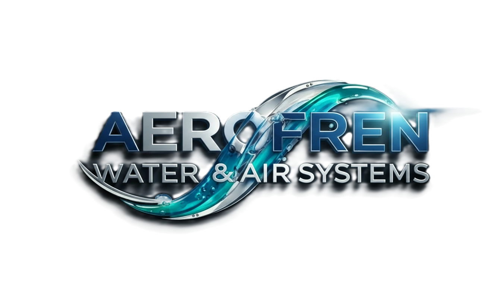
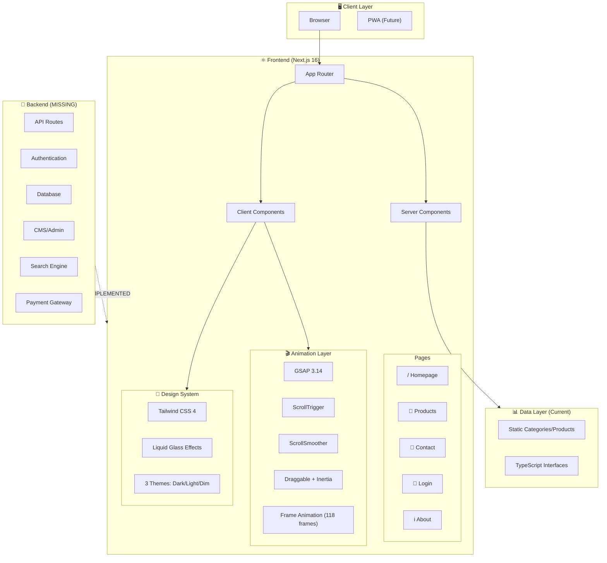

# AEROFREN NEXT - Technical Architecture & Roadmap

<p align="center">
  
</p>

> **Premium Pneumatics E-Commerce Platform**  
> Built with Next.js 16 • React 19 • GSAP Premium Animations • Tailwind CSS 4

---

## 📋 Table of Contents

1. [Executive Summary](#executive-summary)
2. [Tech Stack & Dependencies](#tech-stack--dependencies)
3. [Project Structure](#project-structure)
4. [Architecture Overview](#architecture-overview)
5. [Component Breakdown](#component-breakdown)
6. [Animation System (GSAP)](#animation-system-gsap)
7. [Design System](#design-system)
8. [Data Layer](#data-layer)
9. [Current Features](#current-features)
10. [Missing Features & Backend Roadmap](#missing-features--backend-roadmap)
11. [Animation Improvements Roadmap](#animation-improvements-roadmap)
12. [Modernization Recommendations](#modernization-recommendations)

---

## Executive Summary

**AEROFREN NEXT** is a premium B2B e-commerce platform for industrial pneumatics and fluid control systems. The frontend is built with cutting-edge technologies and features an advanced scroll-controlled animation system inspired by Apple's product pages.

### Key Highlights

| Metric | Value |
|--------|-------|
| **Framework** | Next.js 16.1.1 (App Router) |
| **React Version** | React 19.2.3 |
| **Animation Library** | GSAP 3.14.2 (11 plugins) |
| **Product Categories** | 12 major categories |
| **Total Products** | ~120,000+ SKUs |
| **Subcategories** | 66 subcategories |
| **Languages** | Bilingual (English/Greek) |
| **Theme Support** | 3 themes (Dark, Light, Dim) |
| **Animation Frames** | 118 frames for scroll animation |

---

## Tech Stack & Dependencies

### Core Framework

```
┌─────────────────────────────────────────────────────────────┐
│                     AEROFREN NEXT                           │
├─────────────────────────────────────────────────────────────┤
│  Next.js 16.1.1  │  React 19.2.3  │  TypeScript 5.x        │
├─────────────────────────────────────────────────────────────┤
│           Tailwind CSS 4 (CSS-first approach)               │
└─────────────────────────────────────────────────────────────┘
```

### Production Dependencies

| Package | Version | Purpose |
|---------|---------|---------|
| `next` | 16.1.1 | React framework with App Router |
| `react` | 19.2.3 | UI library (latest stable) |
| `gsap` | 3.14.2 | Premium animation library |
| `@gsap/react` | 2.1.2 | React hooks for GSAP |
| `framer-motion` | 12.25.0 | Secondary animation library |
| `@radix-ui/react-label` | 2.1.8 | Accessible form labels |
| `@radix-ui/react-slot` | 1.2.4 | Component composition |
| `lucide-react` | 0.562.0 | Icon library |
| `styled-components` | 6.3.4 | CSS-in-JS styling |
| `liquid-glass-react` | 1.1.1 | iOS 26-style glassmorphism |
| `class-variance-authority` | 0.7.1 | Component variants |
| `clsx` | 2.1.1 | Conditional classnames |
| `tailwind-merge` | 3.4.0 | Tailwind class merging |

### Dev Dependencies

| Package | Version | Purpose |
|---------|---------|---------|
| `typescript` | 5.x | Type safety |
| `tailwindcss` | 4.x | Utility-first CSS |
| `@tailwindcss/postcss` | 4.x | PostCSS integration |
| `eslint` | 9.x | Code linting |
| `eslint-config-next` | 16.1.1 | Next.js ESLint rules |

---

## Project Structure

```
aerofren-next/
├── public/
│   ├── frames/              # 118 WebP animation frames
│   │   └── frame_XXX_delay-0.04Xs.webp
│   ├── gallery/             # SVG gallery assets
│   ├── images/
│   │   ├── brands/          # Brand logos (SMC, Festo, etc.)
│   │   └── categories/      # Category images
│   └── bg/                  # Background assets (waves.svg)
│
├── src/
│   ├── app/                 # Next.js App Router
│   │   ├── about/           # About page
│   │   ├── admin/           # Admin dashboard (stub)
│   │   ├── contact/         # Contact form
│   │   ├── login/           # Authentication page
│   │   ├── products/        # Product catalog
│   │   │   ├── [category]/
│   │   │   │   └── [subcategory]/
│   │   │   │       └── page.tsx
│   │   │   └── page.tsx
│   │   ├── globals.css      # Design system (614 lines)
│   │   ├── layout.tsx       # Root layout
│   │   └── page.tsx         # Homepage (869 lines)
│   │
│   ├── components/
│   │   ├── catalog/         # Product catalog components
│   │   │   ├── Breadcrumbs.tsx
│   │   │   ├── CategoryCard.tsx
│   │   │   ├── CategorySidebar.tsx
│   │   │   ├── ProductGrid.tsx
│   │   │   ├── ProductsPageContent.tsx
│   │   │   └── SubcategoryCard.tsx
│   │   ├── ui/              # UI primitives
│   │   │   ├── AmbientParticles.tsx
│   │   │   ├── ProductHeroCard.tsx
│   │   │   ├── button.tsx
│   │   │   ├── card.tsx
│   │   │   ├── input.tsx
│   │   │   ├── label.tsx
│   │   │   └── textarea.tsx
│   │   ├── Chatbot.tsx           # AI chatbot interface
│   │   ├── Footer.tsx            # Site footer
│   │   ├── GlassNavigation.tsx   # Glass navigation
│   │   ├── Header.tsx            # Main navigation
│   │   ├── HorizontalGallery.tsx # GSAP draggable gallery
│   │   ├── LiquidButton.tsx      # Liquid glass button
│   │   ├── LiquidGlassSwitcher.tsx # Theme switcher
│   │   ├── Login.tsx             # Login component
│   │   ├── QuoteModal.tsx        # Quote request modal
│   │   ├── ScrollFrameAnimation.tsx # Scroll-linked frames
│   │   ├── SmoothScrollProvider.tsx # GSAP ScrollSmoother
│   │   ├── SocialTooltips.tsx    # Social media links
│   │   ├── StatsBar.tsx          # Statistics bar
│   │   └── WebPBackground.tsx    # Background component
│   │
│   ├── data/
│   │   ├── categories.ts    # Product catalog (796 lines)
│   │   └── types.ts         # TypeScript interfaces
│   │
│   └── lib/
│       ├── gsap/
│       │   ├── client.ts    # GSAP configuration (155 lines)
│       │   ├── index.ts     # GSAP exports
│       │   ├── presets.ts   # Animation presets
│       │   └── SplitText.js # Text splitting
│       ├── registry.tsx     # Component registry
│       └── utils.ts         # Utility functions
│
├── .gitignore
├── package.json
├── next.config.ts
├── tsconfig.json
└── eslint.config.mjs
```

---

## Architecture Overview



---

## Component Breakdown

### Core Components

| Component | Size | Purpose |
|-----------|------|---------|
| `page.tsx` | 869 lines | Homepage with hero, stats, categories, features |
| `Login.tsx` | 25KB | Full authentication UI with animations |
| `LiquidGlassSwitcher.tsx` | 16KB | iOS 26-style theme switcher |
| `Header.tsx` | 16KB | Navigation with mega menu |
| `HorizontalGallery.tsx` | 15KB | GSAP draggable product gallery |
| `Chatbot.tsx` | 13KB | AI chatbot interface |
| `Footer.tsx` | 10KB | Feature-rich footer |
| `ScrollFrameAnimation.tsx` | 8KB | 118-frame scroll animation |

### UI Components

| Component | Purpose |
|-----------|---------|
| `AmbientParticles.tsx` | Floating particle effects |
| `ProductHeroCard.tsx` | Featured product display |
| `button.tsx` | Radix UI button variants |
| `card.tsx` | Card container styles |
| `input.tsx` | Form input components |
| `label.tsx` | Accessible labels |
| `textarea.tsx` | Text area component |

### Catalog Components

| Component | Purpose |
|-----------|---------|
| `Breadcrumbs.tsx` | Navigation breadcrumbs |
| `CategoryCard.tsx` | Category display card |
| `CategorySidebar.tsx` | Sidebar navigation |
| `ProductGrid.tsx` | Product listing grid |
| `ProductsPageContent.tsx` | Products page wrapper |
| `SubcategoryCard.tsx` | Subcategory display |

---

## Animation System (GSAP)

### Registered Plugins (11 Total)

```typescript
gsap.registerPlugin(
    ScrollTrigger,      // Scroll-based animations
    ScrollToPlugin,     // Smooth scroll-to
    ScrollSmoother,     // Buttery smooth scrolling
    SplitText,          // Text splitting for typography
    ScrambleTextPlugin, // Typing/decoding effect
    CustomEase,         // Custom bezier curves
    CustomBounce,       // Physics-based bounces
    Draggable,          // Drag interactions
    InertiaPlugin,      // Momentum physics
    Observer,           // Gesture detection
    MotionPathPlugin    // Path-based animations
);
```

### Custom Easing Curves

| Ease Name | Description | Use Case |
|-----------|-------------|----------|
| `hydraulic` | Industrial pneumatic feel | Hero animations, machinery |
| `gauge` | Pressure gauge settling | Statistics, meters |

### Animation Constants

```typescript
// Duration Scale
DURATION = { fast: 0.4, normal: 0.6, slow: 0.8, xslow: 1.2 }

// Easing Library
EASE = {
    smooth: "power3.out",
    smoothInOut: "power3.inOut",
    emphasis: "power4.out",
    bounce: "back.out(1.4)",
    elastic: "elastic.out(1, 0.3)",
    hydraulic: "hydraulic",  // Custom
    gauge: "gauge"           // Custom
}

// Stagger Timing
STAGGER = { fast: 0.06, normal: 0.1, slow: 0.15 }

// ScrambleText Characters
SCRAMBLE_CHARS = {
    technical: "!<>-_\\/[]{}—=+*^?#_AEROFN",
    greek: "ΑΒΓΔΕΖΗΘΙΚΛΜΝΞΟΠΡΣΤΥΦΧΨΩ",
    numeric: "0123456789!@#$%^&*()"
}
```

### ScrollFrameAnimation

The flagship animation feature - 118 WebP frames controlled by scroll position:

```typescript
// Configuration
const FRAME_COUNT = 118;
const scrollRange = "+=200%"; // Spans Hero + Stats sections
const scrubDuration = 0.5;    // Smooth interpolation

// Frame Pattern
// Indices 1, 4, 7, 10... (i % 3 === 1) → 0.041s delay
// All others → 0.042s delay
```

### Accessibility

```typescript
// Respects prefers-reduced-motion
if (prefersReducedMotion.matches) {
    gsap.globalTimeline.timeScale(0);
    ScrollTrigger.config({ limitCallbacks: true });
}
```

---

## Design System

### globals.css Overview (614 lines)

```
┌──────────────────────────────────────────────────────────────┐
│            AEROFREN Design System v3.0                       │
│        "Apple Hardware UI × Industrial B2B"                  │
└──────────────────────────────────────────────────────────────┘
```

### Theme System

| Theme | Background | Text | Accent |
|-------|------------|------|--------|
| **Dark** (default) | `#06101f` | `#e5e5e5` | `#00bae2` |
| **Light** | `#f0f4f8` | `#1a365d` | `#0066cc` |
| **Dim** | `#152433` | `#d5dbe2` | `#ff48a9` |

### Typography Scale

| Level | Size | Weight | Use Case |
|-------|------|--------|----------|
| Display | 56px | 800 | Hero headlines |
| H1 | 40px | 700 | Page titles |
| H2 | 32px | 700 | Section headers |
| H3 | 24px | 600 | Card titles |
| H4 | 20px | 600 | Subsections |
| Body | 16px | 400 | Paragraphs |
| Body SM | 14px | 400 | Secondary text |
| Caption | 12px | 500 | Labels, metadata |

### Shadow System

```css
--shadow-sm:    0 1px 2px rgba(0, 40, 100, 0.04);
--shadow-md:    0 4px 12px rgba(0, 40, 100, 0.08);
--shadow-lg:    0 12px 32px rgba(0, 40, 100, 0.12);
--shadow-xl:    0 20px 48px rgba(0, 40, 100, 0.16);
--shadow-glass: /* Blue-tinted for brand cohesion */
```

### Liquid Glass Effects (iOS 26)

```css
--glass-bg: rgba(255, 255, 255, 0.7);
--glass-border: rgba(255, 255, 255, 0.4);
--glass-blur: 12px;
--c-glass: #bbbbbc;
--saturation: 150%;
```

---

## Data Layer

### Type Definitions

```typescript
interface Category {
    id: string;
    slug: string;
    nameEn: string;           // English name
    nameEl: string;           // Greek name
    description: string;
    descriptionEl: string;
    image: string;
    icon: CategoryIconName;
    color: string;
    productCount: number;
    subcategories: Subcategory[];
}

interface Product {
    id: string;
    sku: string;
    nameEn: string;
    nameEl: string;
    description: string;
    descriptionEl: string;
    image: string;
    images?: string[];
    category: string;
    subcategory: string;
    specifications?: Record<string, string>;
    brand?: string;
    inStock?: boolean;
}

interface QuoteRequest {
    name: string;
    email: string;
    phone?: string;
    company?: string;
    message: string;
    products?: { productId: string; productName: string; quantity?: number; }[];
}
```

### Product Catalog Summary

| Category | Products | Subcategories |
|----------|----------|---------------|
| Push-in Fittings | 15,995 | 6 |
| Thread Fittings | 11,127 | 5 |
| Couplings | 5,015 | 5 |
| Hoses, Pipes & Clamps | 11,461 | 6 |
| Ball Valves & Check Valves | 9,547 | 5 |
| Pressure Regulators | 14,123 | 6 |
| Pneumatic & Solenoid Valves | 7,345 | 5 |
| Cylinders & Sensors | 8,379 | 6 |
| Air Tools & Blow Guns | 2,781 | 6 |
| Industrial Supplies | 26,783 | 6 |
| Water Filtration | 4,500 | 5 |
| Installation Accessories | 3,200 | 5 |
| **TOTAL** | **~120,256** | **66** |

---

## Current Features

### ✅ Implemented

| Feature | Status | Notes |
|---------|--------|-------|
| **Homepage** | ✅ Complete | Hero, stats, categories, features, CTA |
| **Product Catalog** | ✅ Complete | Dynamic routes with category/subcategory |
| **GSAP Animations** | ✅ Complete | 11 plugins, custom eases |
| **Scroll Frame Animation** | ✅ Complete | 118 frames, canvas-based |
| **ScrollSmoother** | ✅ Complete | Global smooth scrolling |
| **Theme System** | ✅ Complete | 3 themes with liquid glass |
| **Responsive Design** | ✅ Complete | Mobile-first approach |
| **Accessibility** | ✅ Complete | Reduced motion, ARIA |
| **Bilingual Data** | ✅ Complete | EN/EL in data layer |
| **Quote Modal** | ✅ Complete | Request for quote UI |
| **Chatbot UI** | ✅ Complete | AI assistant interface |
| **Contact Form** | ✅ Complete | Contact page with form |
| **Login UI** | ✅ Complete | Authentication interface |

---

## Missing Features & Backend Roadmap

### 🔴 Critical Missing (Backend)

| Feature | Priority | Implementation |
|---------|----------|----------------|
| **API Routes** | 🔴 Critical | Next.js API routes or separate backend |
| **Authentication** | 🔴 Critical | NextAuth.js / Auth.js / Clerk / Supabase Auth |
| **Database** | 🔴 Critical | PostgreSQL / MongoDB / Supabase / PlanetScale |
| **Product Search** | 🔴 Critical | Algolia / Meilisearch / Elasticsearch |
| **CMS Integration** | 🔴 Critical | Sanity / Contentful / Strapi / Payload |

### 🟡 Important Missing

| Feature | Priority | Implementation |
|---------|----------|----------------|
| **Shopping Cart** | 🟡 High | React Context + Database |
| **Checkout Flow** | 🟡 High | Stripe / PayPal integration |
| **Order Management** | 🟡 High | Admin dashboard + database |
| **User Accounts** | 🟡 High | Profile, order history, favorites |
| **Inventory System** | 🟡 High | Real-time stock tracking |
| **Email Notifications** | 🟡 High | Resend / SendGrid / AWS SES |

### 🟢 Nice to Have

| Feature | Priority | Implementation |
|---------|----------|----------------|
| **Language Switcher** | 🟢 Medium | next-intl / i18next |
| **Analytics** | 🟢 Medium | Vercel Analytics / PostHog / Plausible |
| **SEO Optimization** | 🟢 Medium | next-sitemap, structured data |
| **PWA Support** | 🟢 Medium | next-pwa / Serwist |
| **Image CDN** | 🟢 Medium | Cloudinary / imgix |
| **Rate Limiting** | 🟢 Low | Upstash Redis |
| **Testing Suite** | 🟢 Low | Vitest + Playwright |

### Recommended Backend Stack

```
┌──────────────────────────────────────────────────────────────┐
│                   RECOMMENDED BACKEND                        │
├──────────────────────────────────────────────────────────────┤
│                                                              │
│  Option A: Full Supabase Stack                              │
│  ├── Database: PostgreSQL (Supabase)                        │
│  ├── Auth: Supabase Auth                                    │
│  ├── Storage: Supabase Storage                              │
│  ├── Realtime: Supabase Realtime                            │
│  └── Edge Functions: Deno                                   │
│                                                              │
│  Option B: Vercel + Prisma Stack                            │
│  ├── Database: PlanetScale / Neon (serverless MySQL/PG)     │
│  ├── ORM: Prisma                                            │
│  ├── Auth: Auth.js (NextAuth v5)                            │
│  ├── Storage: Vercel Blob / Cloudinary                      │
│  └── API: Next.js API Routes                                │
│                                                              │
│  Option C: Firebase Stack                                    │
│  ├── Database: Firestore                                    │
│  ├── Auth: Firebase Auth                                    │
│  ├── Storage: Firebase Storage                              │
│  ├── Hosting: Firebase Hosting / Cloud Run                  │
│  └── Functions: Cloud Functions                             │
│                                                              │
└──────────────────────────────────────────────────────────────┘
```

---

## Animation Improvements Roadmap

### 🎬 Phase 1: Enhanced Scroll Animations

| Improvement | Description |
|-------------|-------------|
| **Parallax Layers** | Add multi-layer parallax to hero section |
| **3D Perspective** | Add subtle 3D tilt on cards with Observer |
| **Magnetic Buttons** | Cursor-following magnetic effect on CTAs |
| **Blur Transitions** | Depth-of-field blur on section transitions |

### 🎬 Phase 2: Advanced Particle System

| Improvement | Description |
|-------------|-------------|
| **GPU Particles** | WebGL-based particle system (Three.js/PixiJS) |
| **Fluid Simulation** | Air/pneumatic fluid simulation background |
| **Interactive Particles** | Cursor-reactive particle fields |
| **Morphing Shapes** | MorphSVG for logo/icon transitions |

### 🎬 Phase 3: Premium Microinteractions

| Improvement | Description |
|-------------|-------------|
| **Stagger Reveals** | More sophisticated stagger patterns |
| **Text Animations** | SplitText with per-character physics |
| **Loading States** | Skeleton loaders with GSAP |
| **Page Transitions** | Full-page FLIP transitions |
| **Gesture Feedback** | Haptic-style visual feedback |

### 🎬 Phase 4: Performance Optimization

| Improvement | Description |
|-------------|-------------|
| **Frame Caching** | IndexedDB caching for animation frames |
| **Lazy Animation** | Load animations on visibility |
| **Reduced Bundle** | Tree-shake unused GSAP plugins |
| **WebP Optimization** | Further compress animation frames |

---

## Modernization Recommendations

### 1. Server Components Optimization

```typescript
// Convert data-fetching pages to Server Components
// Keep animations in Client Components
export default async function ProductsPage() {
    const categories = await getCategories(); // Server
    return <ProductGrid categories={categories} />; // Client
}
```

### 2. Streaming & Suspense

```typescript
import { Suspense } from 'react';
import ProductGrid from './ProductGrid';
import ProductSkeleton from './ProductSkeleton';

export default function ProductsPage() {
    return (
        <Suspense fallback={<ProductSkeleton />}>
            <ProductGrid />
        </Suspense>
    );
}
```

### 3. Parallel Data Fetching

```typescript
// Fetch all data in parallel
const [categories, brands, featured] = await Promise.all([
    getCategories(),
    getBrands(),
    getFeaturedProducts()
]);
```

### 4. Image Optimization

```typescript
// Use Next.js Image with blur placeholder
<Image
    src="/images/category.jpg"
    alt="Category"
    width={400}
    height={300}
    placeholder="blur"
    blurDataURL="data:image/jpeg;base64,..."
    priority={above the fold}
/>
```

### 5. Edge Runtime

```typescript
// Use edge runtime for fast API responses
export const runtime = 'edge';

export async function GET(request: Request) {
    // Fast edge-based API
}
```

---

## Quick Start

```bash
# Install dependencies
npm install

# Run development server
npm run dev

# Build for production
npm run build

# Start production server
npm start

# Lint code
npm run lint
```

---

## Environment Variables (Future)

```env
# Database
DATABASE_URL=

# Authentication
NEXTAUTH_SECRET=
NEXTAUTH_URL=

# CMS
SANITY_PROJECT_ID=
SANITY_DATASET=

# Search
ALGOLIA_APP_ID=
ALGOLIA_API_KEY=

# Payments
STRIPE_SECRET_KEY=
STRIPE_PUBLISHABLE_KEY=

# Email
RESEND_API_KEY=

# Analytics
NEXT_PUBLIC_POSTHOG_KEY=
```

---

## Contributing

1. Create feature branch from `main`
2. Follow existing code style
3. Use conventional commits
4. Ensure build passes: `npm run build`
5. Submit PR with description

---

## License

Proprietary - AEROFREN © 2026

---

<p align="center">
  <strong>Built with ❤️ for industrial precision</strong><br/>
  <sub>Next.js 16 • React 19 • GSAP 3.14 • Tailwind CSS 4</sub>
</p>
