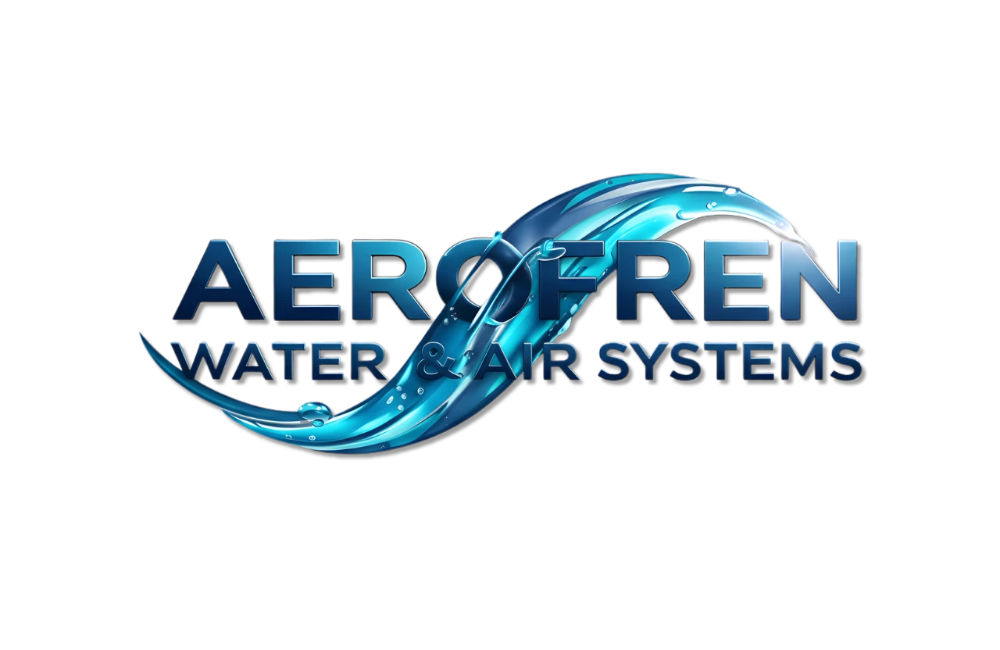

<p align="center">
  
</p>

<h1 align="center">AEROFREN</h1>
<p align="center">
  <strong>Premium B2B E-Commerce Platform για Βιομηχανικά Πνευματικά Συστήματα</strong>
</p>

<p align="center">
  
  
  
  
  
  
</p>

---

## Περί του Project

Το **AEROFREN** είναι ένα premium B2B e-commerce platform για βιομηχανικά πνευματικά εξαρτήματα και συστήματα ελέγχου ρευστών. Χτισμένο με σύγχρονες web τεχνολογίες, διαθέτει cinematic scroll animations, B2B-oriented content architecture και SEO-first πληροφοριακές σελίδες.

### Κύρια Χαρακτηριστικά

- **Next.js 16 App Router** με React 19 και TypeScript
- **B2B product catalog** για πνευματικά συστήματα, εξαρτήματα νερού και φίλτρανση
- **SEO landing pages** για κατηγορίες, υποκατηγορίες, FAQ, glossary και guides
- **Cookie-gated analytics** και lead tracking για βασικά CTAs
- **Firebase backend** για admin και operational features
- **GSAP / motion-heavy frontend** όπου απαιτείται

---

## Tech Stack

| Layer | Τεχνολογία |
|-------|-----------|
| Framework | Next.js 16.1.1 |
| UI Library | React 19.2.3 |
| Language | TypeScript 5.x |
| Styling | Tailwind CSS 4 |
| Backend | Firebase |
| Animations | GSAP + Lenis |
| Testing | Vitest + Testing Library |
| CI/CD | GitHub Actions |

---

## Εγκατάσταση

> Αυτό είναι ιδιωτικό repository. Η πρόσβαση δίνεται μόνο σε εγκεκριμένους collaborators.

```bash
git clone https://github.com/Steliosgeox/aerofren-next.git
cd aerofren-next
npm install
cp .env.example .env.local
npm run dev
```

Άνοιξε το `http://localhost:3000`.

---

## Scripts

| Εντολή | Περιγραφή |
|--------|-----------|
| `npm run dev` | Development server |
| `npm run build` | Production build |
| `npm run start` | Production server |
| `npm run lint` | ESLint |
| `npm run test` | Vitest watch |
| `npm run test:run` | Vitest one-shot |
| `npm run analyze` | Bundle analysis |

---

## Δομή Project

```text
.
├── src/
│   ├── app/
│   ├── components/
│   ├── contexts/
│   ├── data/
│   ├── lib/
│   └── services/
├── public/
├── docs/
├── plans/
├── .github/
├── LICENSE
├── SECURITY.md
└── CONTRIBUTING.md
```

Για περισσότερα, δες το [ARCHITECTURE.md](ARCHITECTURE.md).

---

## GSAP License Note

Το repository περιλαμβάνει project code υπό MIT, αλλά τυχόν **GSAP Club plugins** απαιτούν τη δική τους εμπορική άδεια από τη GreenSock και δεν καλύπτονται από την MIT άδεια του repository.

---

## Συνεισφορά

Δες το [CONTRIBUTING.md](CONTRIBUTING.md).

## Ασφάλεια

Δες το [SECURITY.md](SECURITY.md). Μην ανοίγεις public issue για ευπάθειες.

## Άδεια Χρήσης

Ο κώδικας του repository διανέμεται υπό [MIT License](LICENSE).  
Copyright © 2026 Stylianos Georgoulis
