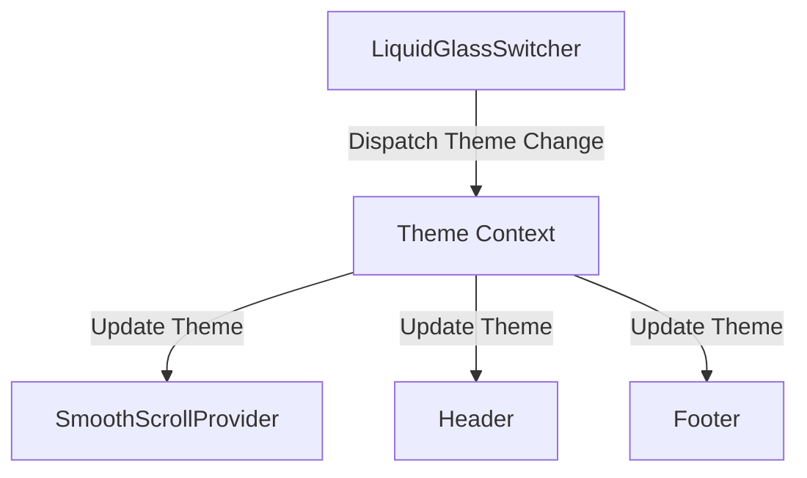
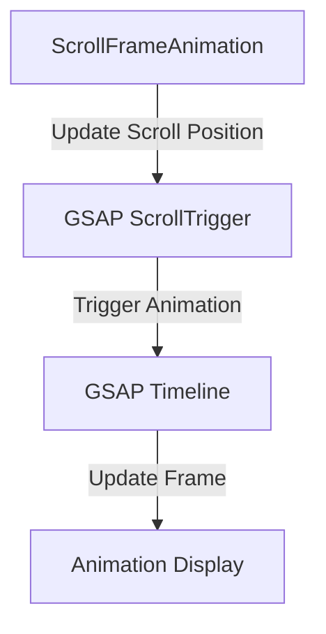
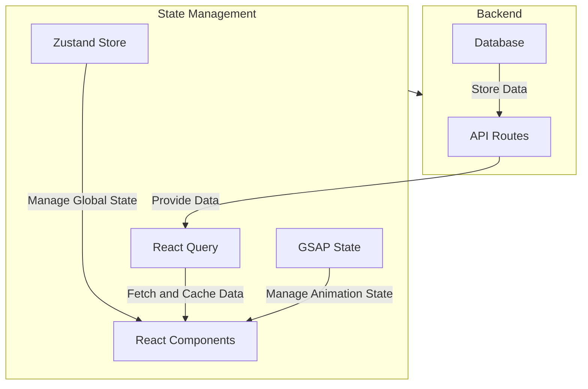

# Phase 2: State Management Deep Dive

## Current State Management System

The current state management system in the Aerofren Next application is minimal and primarily relies on React's built-in state management mechanisms. There is no centralized state management library like Redux, Zustand, or React Query in use.

### State Management Components

1. **React Context API**
   - **Usage**: Used for theme management in `SmoothScrollProvider.tsx` and `LiquidGlassSwitcher.tsx`.
   - **Purpose**: Manages the theme state (dark, light, dim) across the application.
   - **Dependencies**: `next-themes` for theme switching.

2. **Local Component State**
   - **Usage**: Used in various components like `Chatbot.tsx`, `Login.tsx`, and `QuoteModal.tsx`.
   - **Purpose**: Manages local state for UI interactions and form handling.
   - **Dependencies**: React's `useState` and `useEffect` hooks.

3. **GSAP State Management**
   - **Usage**: Used in `ScrollFrameAnimation.tsx` and `SmoothScrollProvider.tsx`.
   - **Purpose**: Manages animation state and scroll position.
   - **Dependencies**: GSAP's `ScrollTrigger` and `ScrollSmoother`.

## State Flow Analysis

### Theme State Flow

### Animation State Flow

## Potential Issues and Recommendations

### Potential Issues

1. **Lack of Centralized State Management**
   - **Issue**: The application lacks a centralized state management system, which can lead to prop drilling and inconsistent state management across components.
   - **Impact**: Difficult to manage global state and share data between components.

2. **No Data Fetching Strategy**
   - **Issue**: The application currently uses static data for the product catalog. There is no strategy for fetching dynamic data from an API.
   - **Impact**: Limited scalability and inability to handle real-time data updates.

3. **Animation Performance**
   - **Issue**: The GSAP animations, especially the 118-frame scroll animation, can be resource-intensive and may impact performance on low-end devices.
   - **Impact**: Potential performance bottlenecks and reduced user experience.

### Recommendations

1. **Adopt a State Management Library**
   - **Recommendation**: Introduce a state management library like Zustand or Redux to centralize state management.
   - **Benefits**: Simplified state management, reduced prop drilling, and improved consistency.

2. **Implement Data Fetching Strategy**
   - **Recommendation**: Use React Query or SWR for data fetching and caching.
   - **Benefits**: Efficient data fetching, caching, and real-time updates.

3. **Optimize Animations**
   - **Recommendation**: Implement lazy loading for animation frames and optimize GSAP configurations.
   - **Benefits**: Improved performance and reduced resource usage.

## Proposed State Management Architecture

## Implementation Steps

1. **Introduce Zustand for Global State Management**
   - Create a Zustand store for managing global state.
   - Migrate existing theme management to Zustand.

2. **Implement React Query for Data Fetching**
   - Set up React Query for fetching product data.
   - Implement caching and real-time updates.

3. **Optimize GSAP Animations**
   - Implement lazy loading for animation frames.
   - Optimize GSAP configurations for better performance.

4. **Integrate with Backend**
   - Set up API routes for data fetching.
   - Connect React Query to the backend API.
