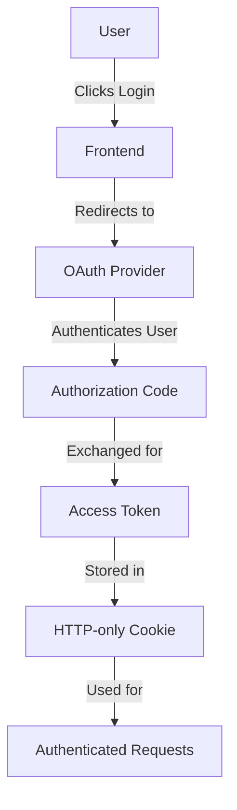
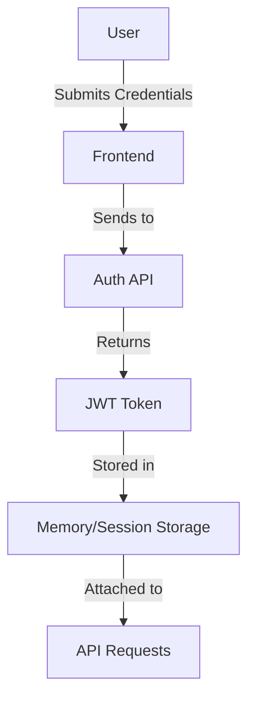
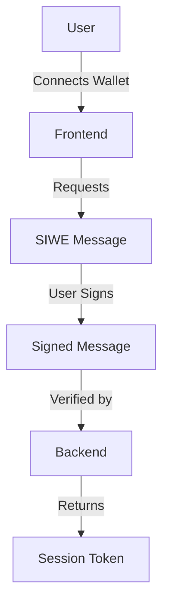

# Phase 4: Future-Proofing & Improvement Windows

## Executive Summary

This analysis evaluates the Aerofren Next project's readiness for backend integration, identifies technical debt, and proposes scalability improvements. The goal is to ensure the project is prepared for future growth and can handle increased complexity.

## 1. Backend Readiness Assessment

### 1.1 API Contract Schemas

Based on the current frontend state shape, the following API contract schemas are proposed:

#### REST API Schema

```typescript
// Categories Endpoint
GET /api/categories
Response: Category[]

// Products Endpoint
GET /api/products?category={category}&subcategory={subcategory}
Response: Product[]

// Quote Request Endpoint
POST /api/quotes
Request Body: QuoteRequest
Response: { success: boolean, quoteId: string }
```

#### GraphQL Schema

```graphql
type Category {
  id: ID!
  slug: String!
  nameEn: String!
  nameEl: String!
  description: String!
  descriptionEl: String!
  image: String!
  icon: String!
  color: String!
  productCount: Int!
  subcategories: [Subcategory!]!
}

type Subcategory {
  id: ID!
  slug: String!
  nameEn: String!
  nameEl: String!
  description: String
  descriptionEl: String
  image: String!
  productCount: Int!
  parentCategory: String!
}

type Product {
  id: ID!
  sku: String!
  nameEn: String!
  nameEl: String!
  description: String!
  descriptionEl: String!
  image: String!
  images: [String!]
  category: String!
  subcategory: String!
  specifications: JSON
  brand: String
  inStock: Boolean
}

input QuoteRequestInput {
  name: String!
  email: String!
  phone: String
  company: String
  message: String!
  products: [QuoteProductInput!]
}

input QuoteProductInput {
  productId: String!
  productName: String!
  quantity: Int
}

type Mutation {
  submitQuoteRequest(input: QuoteRequestInput!): QuoteResponse!
}

type Query {
  categories: [Category!]!
  products(category: String, subcategory: String): [Product!]!
}
```

### 1.2 Authentication Flow Blueprints

#### OAuth 2.0 Flow



#### JWT Flow



#### Web3 Flow (Future)



### 1.3 Offline-First Strategies

#### IndexedDB Strategy

```javascript
// Initialize IndexedDB for caching
const dbPromise = indexedDB.open('AerofrenCache', 1);

dbPromise.onupgradeneeded = (event) => {
  const db = event.target.result;
  db.createObjectStore('categories', { keyPath: 'id' });
  db.createObjectStore('products', { keyPath: 'id' });
};

// Cache data on fetch
async function fetchWithCache(url) {
  const cache = await caches.open('aerofren-v1');
  const cachedResponse = await cache.match(url);
  
  if (cachedResponse) return cachedResponse;
  
  const response = await fetch(url);
  cache.put(url, response.clone());
  return response;
}
```

#### AsyncStorage Strategy (Mobile)

```javascript
// Use AsyncStorage for mobile caching
import AsyncStorage from '@react-native-async-storage/async-storage';

const storeData = async (key, value) => {
  try {
    await AsyncStorage.setItem(key, JSON.stringify(value));
  } catch (e) {
    console.error('Storage error:', e);
  }
};

const getData = async (key) => {
  try {
    const value = await AsyncStorage.getItem(key);
    return value != null ? JSON.parse(value) : null;
  } catch (e) {
    console.error('Retrieval error:', e);
    return null;
  }
};
```

## 2. Tech Debt Ledger

### 2.1 Prioritized Refactors

| Priority | Refactor | Description |
|----------|----------|-------------|
| 🔴 High | Replace `useEffect` spaghetti | Consolidate scattered side effects into React Query mutations |
| 🔴 High | Optimize GSAP bundle | Tree-shake unused GSAP plugins and implement lazy loading |
| 🟡 Medium | Consolidate animation libraries | Reduce redundancy between GSAP and Framer Motion |
| 🟡 Medium | Improve TypeScript coverage | Add missing types and interfaces for better type safety |
| 🟢 Low | Refactor CSS strategy | Evaluate Tailwind vs Styled Components tradeoffs |
| 🟢 Low | Component optimization | Review heavy components like HorizontalGallery |

### 2.2 Deprecation Warnings

| Library | Version | Issue | Recommendation |
|---------|---------|-------|----------------|
| `styled-components` | 6.3.4 | CSS-in-JS runtime overhead | Consider migrating to Tailwind or CSS Modules |
| `framer-motion` | 12.25.0 | Redundant with GSAP | Consolidate to single animation library |
| `liquid-glass-react` | 1.1.1 | Specialized component | Evaluate necessity vs custom implementation |

## 3. Scalability Pitfalls

### 3.1 Monorepo vs. Polyrepo Tradeoffs

#### Monorepo Advantages
- Single codebase for all services
- Easier dependency management
- Unified CI/CD pipeline
- Better code sharing

#### Polyrepo Advantages
- Independent deployment
- Clear ownership boundaries
- Technology flexibility
- Smaller, focused repositories

**Recommendation**: Start with monorepo for current scale, evaluate polyrepo when team grows beyond 10 developers.

### 3.2 Internationalization (i18n) Gaps

| Gap | Description | Recommendation |
|-----|-------------|----------------|
| Missing i18n library | No dedicated i18n solution | Implement next-intl or i18next |
| Hardcoded strings | Some strings not in data layer | Move all strings to translation files |
| RTL support | No right-to-left language support | Add RTL CSS and testing |
| Locale detection | No automatic locale detection | Implement browser/OS locale detection |

### 3.3 CI/CD Pipeline Improvements

| Improvement | Description | Benefit |
|-------------|-------------|---------|
| Deterministic builds | Ensure consistent build outputs | Better caching, fewer surprises |
| Visual regression testing | Automated screenshot comparison | Catch UI regressions early |
| Performance budgeting | Set and enforce size limits | Prevent bundle bloat |
| Parallel testing | Run tests in parallel | Faster feedback loop |
| Canary deployments | Gradual rollout strategy | Reduce deployment risk |

## 4. Detailed Findings and Recommendations

### 4.1 Backend Readiness

**Current State**: The frontend is well-structured with clear data types and component organization. However, it currently relies on static data and lacks backend integration.

**Recommendations**:
1. Implement REST or GraphQL API based on proposed schemas
2. Choose authentication strategy (OAuth recommended for B2B)
3. Implement offline-first caching for better UX
4. Add proper error handling and loading states

### 4.2 Tech Debt

**Current State**: The codebase has some technical debt, particularly around animation libraries and state management.

**Recommendations**:
1. Prioritize high-impact refactors (useEffect consolidation, GSAP optimization)
2. Address deprecation warnings systematically
3. Implement regular code reviews to prevent new debt
4. Add automated testing to catch regressions

### 4.3 Scalability

**Current State**: The project is well-positioned for growth but lacks some scalability features.

**Recommendations**:
1. Implement internationalization early to avoid retrofitting
2. Set up proper monitoring and analytics
3. Implement CI/CD improvements for better deployment safety
4. Consider monorepo structure for future microservices

## 5. Implementation Roadmap

### Phase 1: Critical Backend Integration (High Priority)
1. Implement API routes based on proposed schemas
2. Add authentication (OAuth recommended)
3. Implement offline-first caching
4. Add error handling and loading states

### Phase 2: Tech Debt Reduction (Medium Priority)
1. Consolidate animation libraries
2. Optimize GSAP bundle
3. Improve TypeScript coverage
4. Refactor CSS strategy

### Phase 3: Scalability Enhancements (Low Priority)
1. Implement internationalization
2. Add visual regression testing
3. Implement performance budgeting
4. Set up monitoring and analytics

## 6. Conclusion

The Aerofren Next project demonstrates a solid foundation with modern technologies and good architecture. However, to prepare for backend integration and future growth, several improvements are recommended:

**Strengths**:
- Well-organized component structure
- Clear data types and interfaces
- Modern animation system
- Responsive design

**Weaknesses**:
- Missing backend integration
- Some technical debt around animations
- Limited internationalization support
- Basic CI/CD pipeline

**Critical Recommendations**:
1. Implement backend API and authentication
2. Address high-priority tech debt
3. Add internationalization support
4. Enhance CI/CD pipeline

By implementing these recommendations, the project will be well-positioned for future growth and increased complexity.